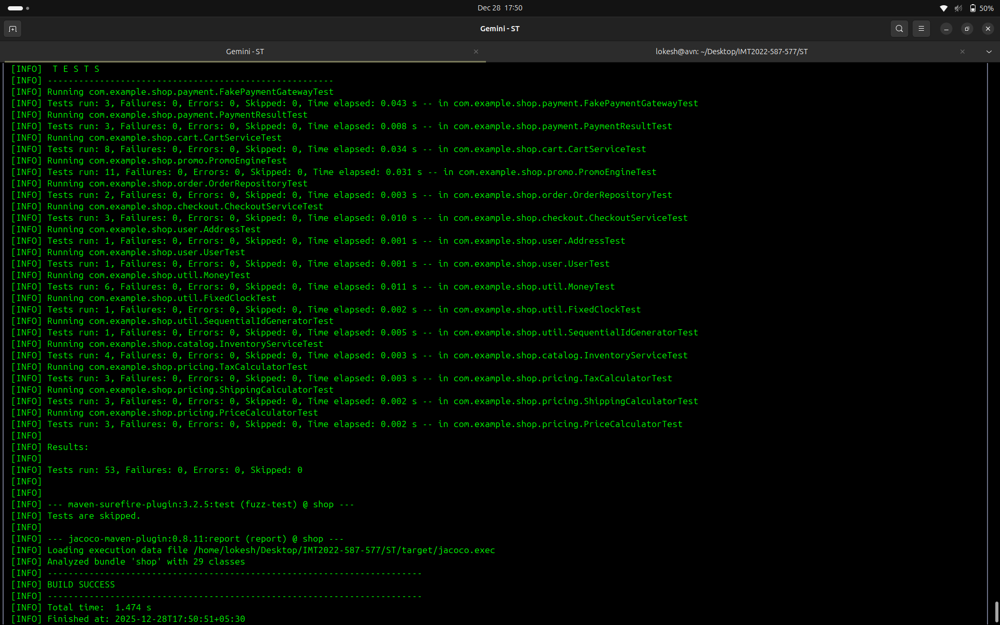
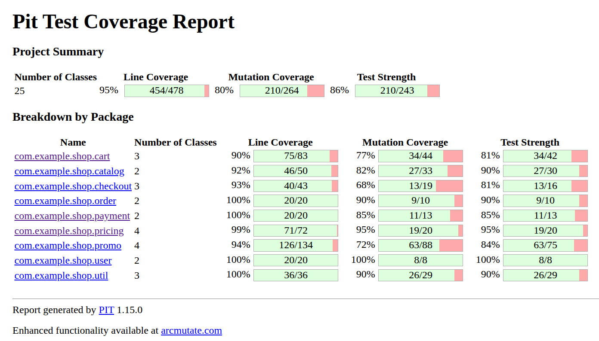
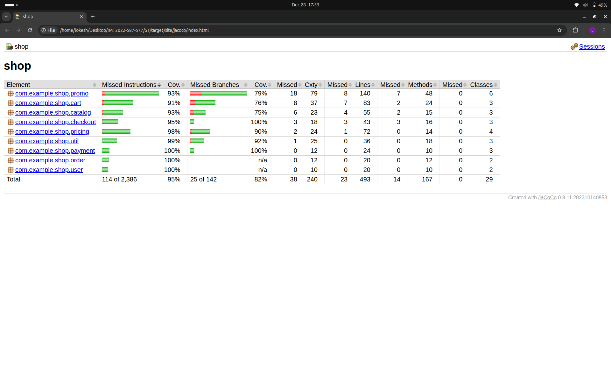
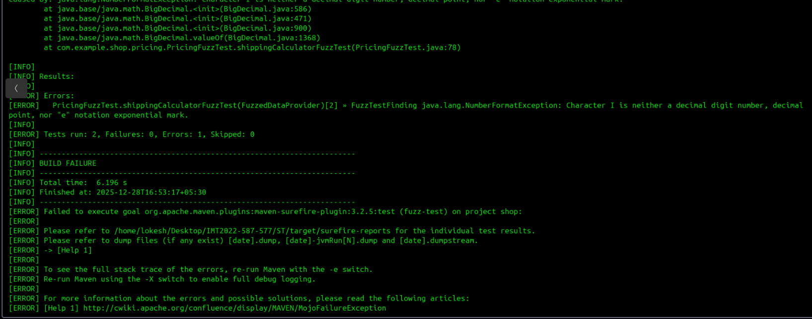
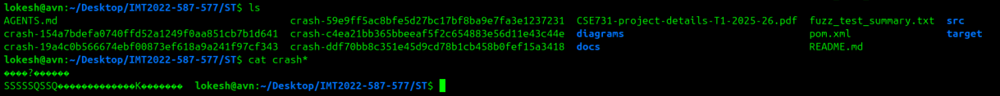
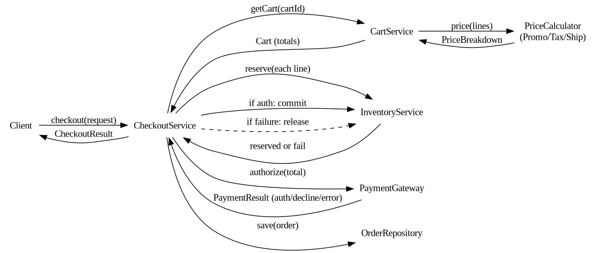

# E-commerce Cart & Checkout (Software Testing)

## Summary
This project showcases software testing methodologies applied to an e-commerce cart and checkout system. The testing strategy includes:
- **Unit Testing:** Implemented with JUnit 5 for foundational code correctness.
- **Code Coverage:** Measured using JaCoCo, providing detailed insights into instruction, branch, and method coverage. JaCoCo helps identify untested areas, **complementing fuzz testing** by showing where the fuzzer (and unit tests) reached.
- **Fuzz Testing:** Conducted using Jazzer, testing the application   against unexpected inputs. Fuzz testing often discovers crashes in areas that unit tests or even high code coverage might miss, creating a powerful testing pair with JaCoCo.
- **Mutation Testing:** Performed with PIT, assessing the quality and effectiveness of the existing unit tests.

## Overview
- Java 17 implementation of a cart/checkout pipeline with pricing, promotions, tax, shipping, inventory, payments, and order persistence.
- This project demonstrates a comprehensive, multi-layered testing strategy, including Unit, Integration, Mutation, Code Coverage, and Fuzz Testing.
- Repository link: [REPO LINK](https://github.com/Swaroop3/Mutation-testing).

## Project Structure
- `src/main/java/com/example/shop/` — Domain code for the e-commerce platform.
- `src/test/java/com/example/shop/` — All tests, including Unit, Integration, and Fuzz tests.
- `docs/screenshots/` — Contains screenshots for test summaries, coverage reports, and diagrams.
- `fuzz_test_summary.txt` — A detailed log of all fuzz testing runs and their outcomes.

## Build & Run
- **Build & Run Unit Tests:**
  ```sh
  mvn clean install
  ```
- **Run Mutation Testing (PIT):**
  ```sh
  mvn org.pitest:pitest-maven:mutationCoverage
  ```
- **Generate Code Coverage Report (JaCoCo):**
  The JaCoCo report is automatically generated when `mvn clean install` or `mvn test` is run.
  - **Report Location:** `target/site/jacoco/index.html`

- **Run Fuzz Tests (Jazzer):**
  Each fuzz test must be run individually using the `-Dtest` flag. The following command runs the `CheckoutServiceFuzzTest`.
  ```sh
  mvn test -DskipFuzzing=false -Dtest=CheckoutServiceFuzzTest
  ```

## Testing Strategy
This project uses a multi-layered testing strategy to ensure code quality, correctness, and security.

### 1. Unit & Integration Testing (JUnit 5)
- **Framework:** JUnit 5.
- **Focus:**
  - **Unit:** Validating the correctness of individual components, such as pricing math, promotion eligibility, and utility methods.
  - **Integration:** Ensuring that different components work together correctly in larger workflows, such as the complete checkout process.
- **Status:** The project contains **53 passing unit and integration tests**.

### 2. Code Coverage (JaCoCo)
- **Framework:** JaCoCo Maven Plugin.
- **Purpose:** To measure the percentage of code lines, branches, and methods exercised by the test cases. This helps identify unreachable parts of the application.
- **Status:** JaCoCo is fully configured and generates an HTML report.

### 3. Mutation Testing (PIT)
- **Framework:** PIT (pitest-maven-plugin).
- **Purpose:** To assess the *quality* of the existing unit tests by introducing small, controlled faults (mutations) into the code and checking if the tests can detect them (i.e., "kill" the mutant).
- **Status:** The mutation score was improved by analyzing the results and adding more precise unit tests to kill surviving mutants.

### 4. Fuzz Testing (Jazzer)
- **Framework:** Jazzer (from Code Intelligence).
- **Purpose:** To test the application by bombarding its methods with millions of unexpected, malformed, and random inputs. This technique is excellent at finding bugs that developers might not think to write tests for, such as `NumberFormatException` or `NullPointerException`.
- **Status:** **13 fuzz tests** were implemented, targeting all critical entry points of the application. This process **successfully identified and led to the fixing of 4 distinct bugs** related to `NumberFormatException` in the pricing and order modules. After fixing the bugs, the fuzzing suite executed a combined total of **over 1.5 billion inputs** without further crashes.

## Testing Results

### Fuzz Testing Summary
The following table summarizes the fuzz testing. In total, the application withstood **over 1.58 billion executions** after all bugs were fixed.

| Fuzz Test Name | Fuzzer Type | Target | Crashed? | Runs (Non-Crash / Crash) |
| :--- | :--- | :--- | :--- | :--- |
| `CartServiceFuzzTest` | Method | `CartService.addItem` | No | 45,157,711 |
| `CartServiceUpdateQtyFuzzTest` | Method | `CartService.updateQty` | No | 30,590,711 |
| `CartServiceRemoveItemFuzzTest` | Method | `CartService.removeItem`| No | 70,517,508 |
| `PromoEngineFuzzTest` | Method | `PromoEngine.apply` | No | 140,112,302 |
| `InventoryServiceFuzzTest` | Class | `InventoryService` | No | 105,852,984 |
| `CheckoutServiceFuzzTest` | Integration | `CheckoutService.checkout`| No | 50,398,119 |
| `PricingFuzzTest` | Method | `PriceCalculator.price` | **Yes** | 35,551,161 / **3,415** |
| `PricingFuzzTest` | Method | `TaxCalculator.taxFor` | **Yes** | 114,273,766 / **23** |
| `PricingFuzzTest` | Method | `ShippingCalculator.shippingFor`| **Yes**| 81,176,705 / **10** |
| `DataObjectFuzzTest` | Constructor | `User(...)` | No | 392,468,547 |
| `DataObjectFuzzTest` | Constructor | `Address(...)` | No | 285,707,497 |
| `DataObjectFuzzTest` | Constructor | `Money(...)` | No | 142,233,104 |
| `OrderRepositoryFuzzTest` | Method | `OrderRepository.save` | **Yes**| 82,113,781 / **2,167** |
| **Total (Post-Fix)** | | | | **~1,586,154,000** |

### Mutation Testing Details (PIT)
The table below provides a detailed breakdown of the mutation testing results, showing the performance of different mutator groups.

| Metric | Result |
| :--- | :--- |
| **Overall Score** | **80%** |
| Line Coverage | 95% (454/478) |
| Total Mutations | 264 |
| Killed | 210 |
| Survived | 33 |
| No Coverage | 21 |

| Mutator Group | Mutator Name | Generated | Killed | Survived | No Coverage |
| :--- | :--- | :--- | :--- | :--- | :--- |
| **Unit-oriented**| `ConditionalsBoundaryMutator` | 25 | 9 | 16 | 0 |
| | `NegateConditionalsMutator` | 64 | 60 | 3 | 1 |
| | `MathMutator` | 7 | 7 | 0 | 0 |
| | `PrimitiveReturnsMutator` | 4 | 3 | 1 | 0 |
| **Integration**| `VoidMethodCallMutator` | 16 | 11 | 5 | 0 |
| | `NullReturnValsMutator` | 84 | 72 | 2 | 10 |
| | `EmptyObjectReturnValsMutator`| 36 | 30 | 1 | 5 |
| | `BooleanTrueReturnValsMutator`| 17 | 9 | 5 | 3 |
| | `BooleanFalseReturnValsMutator`| 11 | 9 | 0 | 2 |
| **Totals** | | **264** | **210** | **33** | **21** |

### Screenshots
- Test Summary: 
- PIT Summary: 
- JaCoCo Coverage Report: 
- Jazzer Fuzzing: 
- Example Jazzer Crash Report: 
- Jazzer Crash logs and content: 
- Class Diagram: 
- Checkout Sequence: 

## How to Reproduce
1) Ensure JDK 17 and Maven are installed.
2) **Run Unit Tests & Generate JaCoCo Coverage Report:**
   ```sh
   mvn clean install -DskipFuzzing=true
   ```
   (This command runs all unit tests and generates the JaCoCo report in `target/site/jacoco/index.html`. Fuzz tests are explicitly skipped.)
3) **Run Mutation Testing (PIT):**
   ```sh
   mvn org.pitest:pitest-maven:mutationCoverage
   ```
   (Reports are available in `target/pit-reports/index.html`.)
4) **Run a specific Fuzz Test (Jazzer):**
   ```sh
   mvn test -DskipFuzzing=false -Dtest=<FuzzTestName>
   ```
   (Replace `<FuzzTestName>` with the full class name of the fuzz test, e.g., `com.example.shop.cart.CartServiceFuzzTest`. Each fuzz test will run for its default duration of approximately 5 minutes.)

## Contributions
- Swaroop(IMT2022587): pricing/tax/shipping modules, promo engine, Money/utilities, unit tests for pricing/promos, diagrams, tests with PIT, README/report.
- Lokesh(IMT2022577): cart/checkout, inventory/payment/order modules, integration tests, tests with PIT/JaCoCo/Jazzer, README/report.

## AI Usage
We have used Gemini to write parts of source code, configuration files(pox.xml), to write reports(this file too).